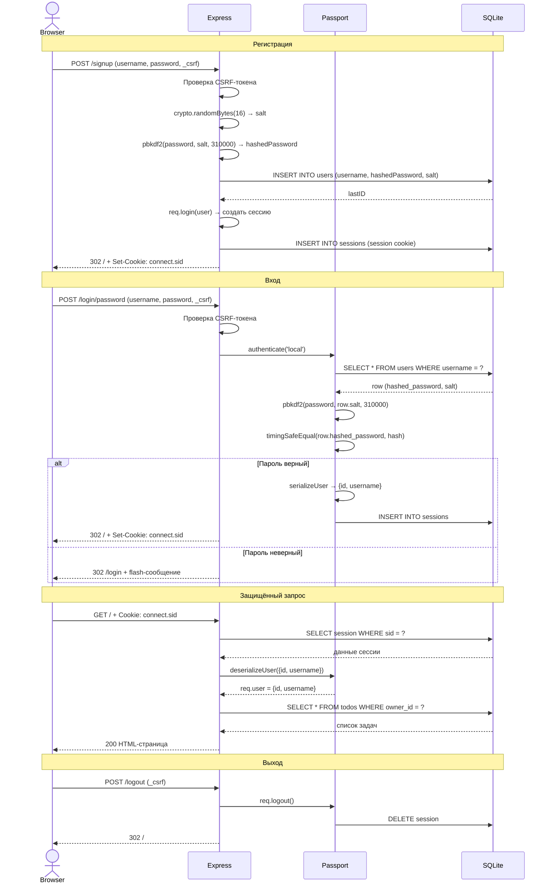

# Ревью проекта todos-express-password

## 1. Краткое описание проекта и выбранной области анализа

**Проект:** [todos-express-password](https://github.com/passport/todos-express-password) — эталонное приложение-пример от авторов библиотеки Passport.js. Демонстрирует аутентификацию по паролю в стеке Express + SQLite + EJS (шаблонизатор HTML).

**Стек:** Node.js, Express 4, Passport.js, SQLite3, EJS.

**Структура:**
```
app.js          — точка входа, конфигурация Express
db.js           — инициализация SQLite и схемы БД
routes/auth.js  — маршруты входа/выхода/регистрации + настройка Passport
routes/index.js — маршруты todo (список, создание, редактирование, удаление)
views/          — EJS-шаблоны (login, signup, index, home, error)
bin/www         — HTTP-сервер
```

**Выбранная область анализа:** вся кодовая база целиком, с акцентом на безопасность аутентификации и корректность бизнес-логики.

### Диаграмма flow аутентификации

> Проект использует **сессионную** аутентификацию (не JWT): сессия хранится в SQLite на сервере, браузер получает только cookie с идентификатором сессии.



---

## 2. Найденные проблемы

### Тип 1. Баги и ошибки выполнения

---

#### Баг 1.1 — Некорректное сохранение статуса `completed` при создании задачи

**Файл:** `routes/index.js`, строка 61

```js
db.run('INSERT INTO todos (owner_id, title, completed) VALUES (?, ?, ?)', [
  req.user.id,
  req.body.title,
  req.body.completed == true ? 1 : null   // <-- проблема здесь
]);
```

**Почему это проблема:**
HTML-форма отправляет значение чекбокса как строку `"on"`. В JavaScript выражение `"on" == true` вычисляется как `false` (строка приводится к числу `NaN`, `true` — к `1`, `NaN ≠ 1`). То есть, даже если добавить в форму чекбокс «создать как выполненное», задача всегда сохранится со статусом `null`.

В той же версии обработчика редактирования (строка 83) та же логика написана правильно:
```js
req.body.completed !== undefined ? 1 : null  // правильно: проверяем наличие поля
```

Несоответствие подходов в одном файле — источник потенциального бага при расширении формы создания задачи.

**Рекомендация:** заменить `== true` на `!== undefined` для единообразия:
```js
req.body.completed !== undefined ? 1 : null
```

---

#### Баг 1.2 — Ошибка в OpenAPI-схеме: тип поля `password`

**Файл:** `routes/auth.js`, строки 113–116

```yaml
password:
  type: number   # <-- баг: пароль — это строка, не число
```

**Почему это проблема:**
Пароль — текстовая строка. Тип `number` — фактически неверная документация. Клиенты, генерирующие код по OpenAPI-спецификации (например, SDK), отправят некорректный тип данных.

**Рекомендация:**
```yaml
password:
  type: string
  format: password
```

---

#### Баг 1.3 — Дублирование числа итераций PBKDF2

**Файлы:** `db.js`, строка 29 и `routes/auth.js`, строка 24

```js
// db.js:29
crypto.pbkdf2Sync('letmein', salt, 310000, 32, 'sha256')

// routes/auth.js:24
crypto.pbkdf2(password, row.salt, 310000, 32, 'sha256', ...)
```

**Почему это проблема:**
Константа `310000` (количество итераций хэширования) продублирована в двух несвязанных файлах. Если потребуется обновить её (например, в соответствии с новыми рекомендациями OWASP), разработчик может изменить её только в одном месте. В результате пароль пользователя при входе будет хэшироваться с другим числом итераций и сравнение `timingSafeEqual` всегда вернёт `false` — пользователи не смогут войти.

**Рекомендация:** вынести в общий модуль:
```js
// config/crypto.js
module.exports = { PBKDF2_ITERATIONS: 310000, KEY_LENGTH: 32, DIGEST: 'sha256' };
```

---

### Тип 2. Безопасность

---

#### Проблема 2.1 — Hardcoded секрет сессии

**Файл:** `app.js`, строка 31

```js
app.use(session({
  secret: 'keyboard cat',   // <-- захардкоженный секрет
  ...
}));
```

**Почему это проблема:**
`'keyboard cat'` — широко известная строка-заглушка из документации Express. Любой, кто знает этот секрет (а это весь интернет), может сфабриковать подписанные куки сессии и получить доступ к аккаунтам других пользователей. Это критическая уязвимость при деплое в продакшн.

**Рекомендация:**
```js
secret: process.env.SESSION_SECRET  // и завершать запуск, если переменная не задана
```

---

#### Проблема 2.2 — Нет валидации пароля при регистрации

**Файл:** `routes/auth.js`, строки 158–178

```js
router.post('/signup', function(req, res, next) {
  var salt = crypto.randomBytes(16);
  crypto.pbkdf2(req.body.password, salt, 310000, 32, 'sha256', function(err, hashedPassword) {
    // req.body.password нигде не проверяется перед хэшированием
```

**Почему это проблема:**
Приложение принимает и сохраняет пустой пароль (`""`). Пользователь с пустым паролем может войти, введя пустую строку в поле пароля — при этом CSRF и хэширование ничему не мешают.

**Рекомендация:** добавить явную проверку до хэширования:
```js
if (!req.body.username || !req.body.password || req.body.password.length < 8) {
  return res.redirect('/signup');
}
```

---

#### Проблема 2.3 — Нет защиты от брутфорса на `/login/password`

**Файл:** `routes/auth.js`, строки 120–124

```js
router.post('/login/password', passport.authenticate('local', {
  successReturnToOrRedirect: '/',
  failureRedirect: '/login',
  failureMessage: true
}));
```

**Почему это проблема:**
Нет ограничения на количество попыток входа. Злоумышленник может перебирать пароли автоматически без каких-либо задержек или блокировок. Типовое решение — пакет `express-rate-limit`.

---

#### Проблема 2.4 — Невнятная ошибка при регистрации с уже занятым именем

**Файл:** `routes/auth.js`, строки 162–167

```js
db.run('INSERT INTO users ...', [...], function(err) {
  if (err) { return next(err); }  // любая ошибка БД -> 500
```

**Почему это проблема:**
Если имя пользователя уже занято, SQLite возвращает ошибку нарушения уникального ограничения (`SQLITE_CONSTRAINT`). Приложение передаёт её в обработчик ошибок Express и показывает страницу 500. Пользователь не понимает, что именно пошло не так.

**Рекомендация:** проверять `err.code === 'SQLITE_CONSTRAINT'` и делать редирект с понятным сообщением:
```js
if (err) {
  if (err.code === 'SQLITE_CONSTRAINT') {
    return res.redirect('/signup?error=username_taken');
  }
  return next(err);
}
```

---

### Тип 3. Архитектура

---

#### Проблема 3.1 — Конфигурация Passport смешана с маршрутизацией

**Файл:** `routes/auth.js`, строки 19–59

Файл `routes/auth.js` одновременно содержит:
- настройку стратегии аутентификации (`passport.use(...)`)
- настройку сериализации сессии (`passport.serializeUser`, `passport.deserializeUser`)
- определение маршрутов (`router.get`, `router.post`)

**Почему это проблема:**
Конфигурация Passport — это глобальное состояние приложения, которое не относится к роутеру. При росте проекта (добавление OAuth, JWT и т.д.) этот файл станет трудночитаемым. В Express-приложениях принято выносить настройку Passport в отдельный файл, например `config/passport.js`.

---

#### Проблема 3.2 — Путь к базе данных задан относительно рабочей директории

**Файл:** `db.js`, строка 7

```js
var db = new sqlite3.Database('./var/db/todos.db');
```

**Почему это проблема:**
Путь `./var/db/todos.db` разрешается относительно директории, из которой запущен процесс Node.js, а не относительно файла `db.js`. Если приложение запустить из другой директории (например, `node /path/to/app/bin/www` из домашней директории), БД будет создана в неожиданном месте.

**Рекомендация:** использовать `__dirname`:
```js
var db = new sqlite3.Database(path.join(__dirname, 'var/db/todos.db'));
```

---

#### Проблема 3.3 — Синхронная операция создания директории при старте

**Файл:** `db.js`, строка 5

```js
mkdirp.sync('./var/db');
```

**Почему это проблема:**
`mkdirp.sync` блокирует event loop Node.js при загрузке модуля. Для серверного приложения предпочтительнее асинхронная инициализация. Это также затрудняет тестирование модуля.

---

### Тип 4. Читаемость и качество кода

---

#### Проблема 4.1 — Массивный inline-JavaScript в шаблоне

**Файл:** `views/index.ejs`, строки 47, 50

```html
<label ondblclick="this.closest('li').className = this.closest('li').className + ' editing'; 
  this.closest('li').querySelector('input.edit').focus(); 
  this.closest('li').querySelector('input.edit').value = ''; 
  this.closest('li').querySelector('input.edit').value = '<%= todo.title %>';">
```

**Почему это проблема:**
Многострочный JavaScript прямо в HTML-атрибуте:
- нечитаем и неотлаживаем;
- нарушает разделение ответственности между шаблоном и логикой;
- значение `todo.title` вставляется без экранирования в контексте JS-строки — если название задачи содержит одинарную кавычку или угловую скобку, это может привести к XSS.

Например, задача с заголовком `it's done` сломает атрибут.

**Рекомендация:** вынести логику в отдельный JS-файл и использовать `data`-атрибуты для передачи данных.

---

#### Проблема 4.2 — Повсеместное использование `var`

**Файлы:** все `.js`-файлы

Во всём проекте используется `var` вместо `const` и `let`.

**Почему это проблема:**
`var` имеет функциональную область видимости и поднимается (hoisting), что может привести к неочевидным ошибкам. `const` и `let` (доступны с Node.js 6, т.е. с 2016 года) дают блочную область видимости и явно выражают намерение: переменная изменяется или нет.

---

### Тип 5. Тесты

Проект **не содержит ни одного теста**. В `package.json` нет тестового скрипта, нет директории `test/` или `spec/`.

**Критически важные сценарии, которые следует покрыть тестами:**
- Успешная регистрация нового пользователя
- Попытка регистрации с уже занятым именем
- Успешный вход и проверка сессии
- Вход с неверным паролем
- Создание, редактирование и удаление задачи
- Попытка доступа к задачам другого пользователя (изоляция данных)

---

### Тип 6. Документация

- OpenAPI-аннотации присутствуют только у двух маршрутов (`GET /login` и `POST /login/password`) из восьми. Маршруты `/signup`, `/logout`, `/`, `/:id`, `/toggle-all`, `/clear-completed` — не задокументированы.
- Комментарий в `db.js` (строка 26) описывает начального пользователя (`alice / letmein`), но этот тестовый пользователь попадёт в продакшн базу данных — это не задокументировано как явный риск.

---

## 3. Итоговый вывод

Проект выполняет свою роль — показывает, как интегрировать Passport.js с Express и SQLite. Логика аутентификации в целом корректна: используется `timingSafeEqual`, `pbkdf2` с солью, CSRF-защита, параметризованные SQL-запросы.

**Основные приоритеты для исправления:**

| Приоритет | Проблема |
|-----------|----------|
| Критичный | Hardcoded секрет сессии `'keyboard cat'` |
| Высокий | Нет валидации пароля при регистрации |
| Высокий | Нет защиты от брутфорса |
| Средний | 500-ошибка при занятом имени пользователя |
| Средний | Дублирование константы PBKDF2 |
| Средний | Потенциальный XSS в inline-JS шаблона |
| Низкий | OpenAPI-схема: тип поля password = number |
| Низкий | Отсутствие тестов |

Проект не предназначен для продакшн-деплоя (это явно учебный пример), однако для тех, кто использует его как основу реального приложения, перечисленные проблемы критически важны.

---

## Приложение: использованные промпты

1. «Прочитай все файлы проекта todos-express-password и дай полную картину структуры: назначение каждого модуля, точки входа, маршруты, схема БД.»

2. «Найди потенциальные баги в бизнес-логике: обрати особое внимание на обработку значений форм, сравнение типов, логику `completed` в todo.»

3. «Проанализируй безопасность аутентификации: хранение паролей, управление сессией, защита от атак.»

4. «Найди архитектурные проблемы: разделение ответственности, хардкод путей и констант, синхронные операции.»

5. «Проверь качество кода: читаемость шаблонов, стиль JavaScript, дублирование.»

6. «Составь итоговый code review в структурированном формате с указанием файлов, строк, фрагментов кода и рекомендаций.»
