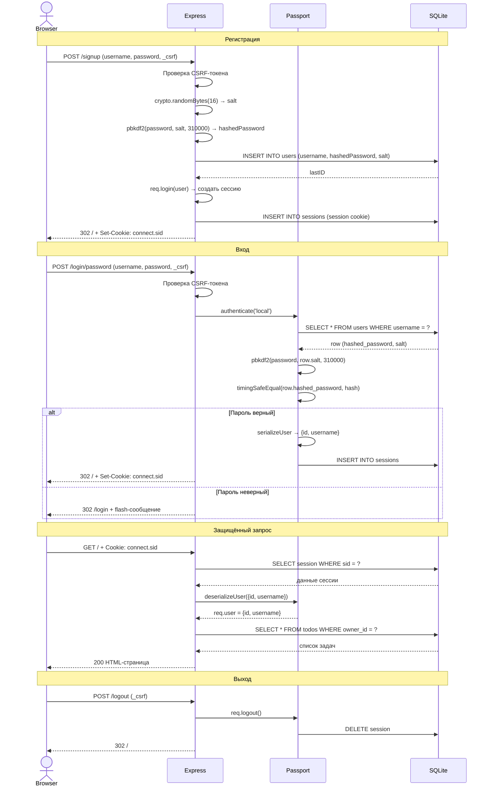

```mermaid
sequenceDiagram
    actor Browser
    participant Express
    participant Passport
    participant SQLite

    Note over Browser,SQLite: Регистрация
    Browser->>Express: POST /signup (username, password, _csrf)
    Express->>Express: Проверка CSRF-токена
    Express->>Express: crypto.randomBytes(16) → salt
    Express->>Express: pbkdf2(password, salt, 310000) → hashedPassword
    Express->>SQLite: INSERT INTO users (username, hashedPassword, salt)
    SQLite-->>Express: lastID
    Express->>Express: req.login(user) → создать сессию
    Express->>SQLite: INSERT INTO sessions (session cookie)
    Express-->>Browser: 302 /  + Set-Cookie: connect.sid

    Note over Browser,SQLite: Вход
    Browser->>Express: POST /login/password (username, password, _csrf)
    Express->>Express: Проверка CSRF-токена
    Express->>Passport: authenticate('local')
    Passport->>SQLite: SELECT * FROM users WHERE username = ?
    SQLite-->>Passport: row (hashed_password, salt)
    Passport->>Passport: pbkdf2(password, row.salt, 310000)
    Passport->>Passport: timingSafeEqual(row.hashed_password, hash)
    alt Пароль верный
        Passport->>Passport: serializeUser → {id, username}
        Passport->>SQLite: INSERT INTO sessions
        Express-->>Browser: 302 /  + Set-Cookie: connect.sid
    else Пароль неверный
        Express-->>Browser: 302 /login  + flash-сообщение
    end

    Note over Browser,SQLite: Защищённый запрос
    Browser->>Express: GET /  + Cookie: connect.sid
    Express->>SQLite: SELECT session WHERE sid = ?
    SQLite-->>Express: данные сессии
    Express->>Passport: deserializeUser({id, username})
    Passport-->>Express: req.user = {id, username}
    Express->>SQLite: SELECT * FROM todos WHERE owner_id = ?
    SQLite-->>Express: список задач
    Express-->>Browser: 200 HTML-страница

    Note over Browser,SQLite: Выход
    Browser->>Express: POST /logout (_csrf)
    Express->>Passport: req.logout()
    Passport->>SQLite: DELETE session
    Express-->>Browser: 302 /
```